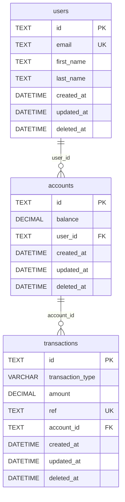

# wallet

A simple wallet application that allows you to deposit, withdraw, and check your balance.

## Getting Started

These instructions will get you a copy of the project up and running on your local machine for development and testing purposes.

## Prerequisites

- install [go](https://go.dev/doc/install)

## Installing
- clone the repository
- run `make run` to start the application
- run `make watch` to start the application with live reload
- run `make clean` to clean up the binary from the last build

## Documentation

After running the application, you can access the documentation at `http://localhost:8080/swagger/index.html`

## Schema
- check [wallet schema](wallet-schema.sql) for the schema
- you can also dumb [wallet.db](wallet.db) to to any sqlite client to see the schema

