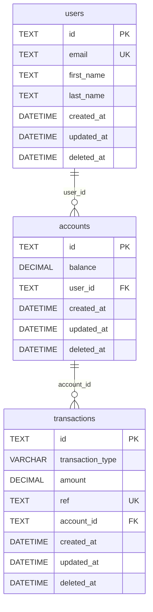

# wallet

A simple wallet application that allows you to deposit, withdraw, and check your balance.

## Motivation

Service was created upon request from a company hiring for Senior Backend Engineer position.

## Getting Started

These instructions will get you a copy of the project up and running on your local machine for development and testing purposes.

## Prerequisites

- install [go](https://go.dev/doc/install)

## Installation

- clone the repository
- run `make run` to start the application
- run `make watch` to start the application with live reload
- run `make clean` to clean up the binary from the last build

## 🚀️ Deployment Bonus:

- The application API docs is hosted on my server 👉️ [here](http://198.199.64.195:8082/swagger/index.html)

## Documentation

After running the application, you can access the documentation at `http://localhost:8080/swagger/index.html`

## Schema

- check [wallet schema](wallet-schema.sql) for the schema
- you can also dumb [wallet.db](wallet.db) to to any sqlite client to see the schema

## API Endpoints

| Endpoint                          | Method | Description                                      | Parameters                     | Body
|-----------------------------------|--------|--------------------------------------------------|--------------------------------|--------------------|
| `/api/v1/`                        | GET    | A simple hello world endpoint to check if the API is running. | None              | None                           |
| `/api/v1/health`                  | GET    | Checks the health status of the API.             | None                           | None                           |
| `/api/v1/accounts`                | POST   | Creates a new account for a user.                | None                           | `{"email", "first_name", "last_name"}` |
| `/api/v1/accounts/:id/top-up`     | POST   | Adds funds to a specific account.                | `id`: The ID of the account to top up. | `{"amount"}` |
| `/api/v1/accounts/:id/charge`     | POST   | Deducts funds from a specific account.           | `id`: The ID of the account to charge. | `{"amount"}` |

